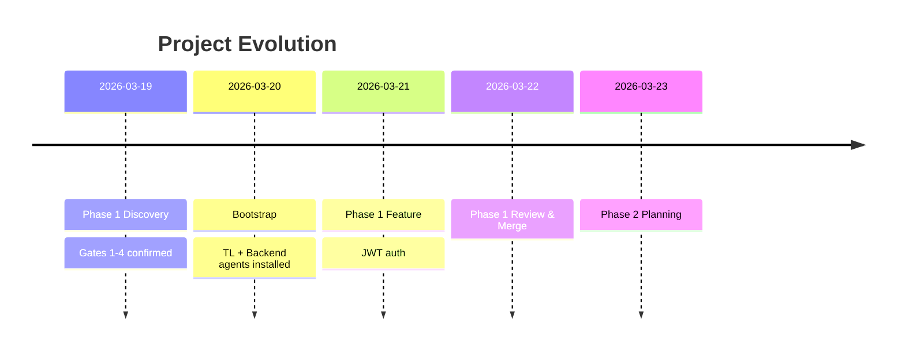

# ADR-005: Living Documentation via Machine-Readable Artifacts

**Date**: 2026-03-19
**Status**: Proposed
**Context**: The template generates artifacts (REQUIREMENTS.md, ARCHITECTURE.md, PLAN.md, phase-summary.md, conventional commits) that are currently consumed only by humans. These artifacts contain structured information that external tools (visualization, metrics, continuity) could consume to create "living documentation" — a dynamic view of the project's evolution.

---

## Decision

The template will generate and maintain **machine-readable artifacts** alongside human-readable ones. These enable:

1. **Visualization tools** to consume commits, PLAN.md, phase-summaries → generate timelines, Gantt charts, impact graphs
2. **External integrations** (Linear, Notion, GitHub Projects) to sync project state
3. **Metrics dashboards** to track progress, velocity, architectural quality
4. **Session continuity** to reconstruct project context from artifacts alone

## Mechanism

### Layer 1: Structured Artifacts (Already Exists)

- `REQUIREMENTS.md` — structured requirements (YAML frontmatter + Markdown)
- `ARCHITECTURE.md` — stack, decisions, trade-offs
- `PLAN.md` — phases with dates, dependencies, DoD
- `OPEN_QUESTIONS.md` — level-3 challenges and decisions deferred
- `phase-summary.md` — generated at `/close-phase`; contains: phase name, dates, commits, files changed, next phase

### Layer 2: Machine-Readable Index (New)

Create `machine-readable/project-evolution.jsonl` (JSON Lines format):

```jsonl
{"event": "phase_start", "phase": "Phase 1 - Discovery", "date": "2026-03-19T10:00:00Z", "description": "Inception agent phase 1"}
{"event": "phase_gate", "phase": 1, "gate": 1, "status": "confirmed", "date": "2026-03-19T11:30:00Z"}
{"event": "artifact_created", "file": "REQUIREMENTS.md", "date": "2026-03-19T12:00:00Z", "lines": 145}
{"event": "commit", "hash": "abc123", "type": "feat", "scope": "auth", "message": "add JWT auth", "date": "2026-03-19T14:00:00Z"}
{"event": "pr_created", "number": 1, "title": "Add JWT auth", "date": "2026-03-19T14:30:00Z", "files_changed": 5}
{"event": "pr_merged", "number": 1, "date": "2026-03-19T15:00:00Z", "commits": 3}
{"event": "phase_complete", "phase": 1, "date": "2026-03-19T16:00:00Z", "duration_hours": 6}
```

This JSONL can be:
- **Streamed** to external dashboards in real-time
- **Queried** by local scripts (duration, velocity, quality metrics)
- **Visualized** by tools like [Mermaid](https://mermaid.js.org), [Excalidraw](https://excalidraw.com), or custom dashboards

### Layer 3: Visualization Templates (Optional, Per-Project)

Projects can add:

```
machine-readable/
├── project-evolution.jsonl    ← events log (REQUIRED if tracking enabled)
├── timeline.mmd               ← Mermaid timeline (auto-generated from PLAN.md)
├── architecture.excalidraw    ← Excalidraw diagram (manually maintained, versioned)
├── metrics.json               ← velocity, quality scores, coverage trends
└── integrations/
    ├── github-sync.yml        ← config for syncing to GitHub Projects
    └── linear-sync.yml        ← config for syncing to Linear board
```

### Layer 4: Continuous Generation

Hooks auto-generate these artifacts:

- **SessionStart**: parse recent commits → update `project-evolution.jsonl`
- **PostToolUse(Write)**: detect file type (PLAN.md, REQUIREMENTS.md) → validate YAML frontmatter
- **PostToolUse(Bash, git merge)**: detect merge → create phase-summary.md + append to `project-evolution.jsonl`
- **Stop**: list metrics from `project-evolution.jsonl` (commits this session, phases, quality gates passed)

---

## What This Enables

### 1. Timeline Visualization (Mermaid)

Auto-generate from PLAN.md + phase-summaries:



### 2. Architecture Evolution (Excalidraw)

Manually maintained diagram showing:
- Initial architecture (ARCHITECTURE.md v1.0)
- Module additions over time (each phase)
- Dependency graph (service → ports → infra)
- External integrations (MCP servers added)

Tool: Excalidraw with version history in git (`.excalidraw` JSON files).

### 3. Metrics Dashboard

From `project-evolution.jsonl`:

```
📊 Project Metrics
  Total phases: 3
  Completed: 2
  In progress: 1

  Velocity:
    Phase 1: 6 hours (Discovery)
    Phase 2: 12 hours (Implementation)

  Quality gates:
    Gates passed: 7/7 ✓
    Level-3 challenges: 2 (both justified + registered)

  Commits this session: 8
    feat: 4
    fix: 2
    docs: 2

  Files changed:
    Python: 320 lines
    Markdown: 450 lines
```

### 4. External Integrations

Example: Sync PLAN.md to GitHub Projects board:

```yaml
# .claude/integrations/github-projects-sync.yml
enabled: true
board_url: "https://github.com/users/dmorales/projects/7"
source: "PLAN.md"
sync_on:
  - "phase_complete"
  - "artifact_created"
mapping:
  "Phase 1" -> "In Progress"
  "Phase 2" -> "Not started"
  "Gate confirmed" -> "mark as done"
```

---

## Implementation Path

### Phase 1 (This Session): Foundation
- [x] Define `project-evolution.jsonl` schema
- [x] Document this ADR
- [ ] Create example `project-evolution.jsonl` for a sample project
- [ ] Update SessionStart hook to parse commits → JSONL entries

### Phase 2 (Next Session): Visualization
- [ ] Add `timeline.mmd` generation from PLAN.md
- [ ] Create Excalidraw template for architecture diagrams
- [ ] Implement `/metrics` command to parse JSONL → dashboard

### Phase 3: External Sync (Optional)
- [ ] GitHub Projects integration (read PLAN.md → create/update cards)
- [ ] Linear integration (sync issues ↔ PLAN.md phases)
- [ ] Webhook support (notify external dashboards on phase change)

---

## Benefits Over Time

| When | Benefit |
|---|---|
| **During discovery** | Evolution log shows thinking process (invaluable for `/inception --resume`) |
| **During development** | Metrics + timeline visible to team in real-time |
| **At phase close** | Automatic generation of "what we did" narrative (saves manual effort) |
| **End of project** | Complete audit trail + metrics → post-mortems, learning |
| **Next project** | Template can analyze this project's metrics → suggest phase durations, resource allocation |

---

## Non-Goals

- **Real-time dashboarding**: Nice-to-have, not required. JSONL format means tools can be added later.
- **Automatic code metrics**: (e.g., cyclomatic complexity, test coverage %). These require language-specific tooling; template stays language-agnostic.
- **AI-powered insights**: (e.g., "you're running 2x slower than similar projects"). Possible future, not in scope.

---

## Consequence

Projects bootstrapped from this template will auto-generate `machine-readable/project-evolution.jsonl`. External tools can consume this file to:
1. Visualize timelines and evolution
2. Alert when phases complete
3. Sync with external project management tools
4. Calculate velocity and quality trends

This creates a **continuous feedback loop**: the template documents its own growth, and that documentation informs improvements to future projects.

---

## Related

- ADR-004: Strict workflow adoption (ensures consistent, parseable commits)
- `machine-readable/index.yaml` (already defines all available artifacts + tools)
- `PLAN.md` template (add YAML frontmatter for machine parsing)
